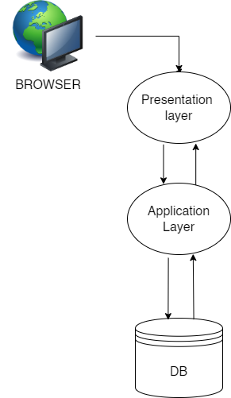
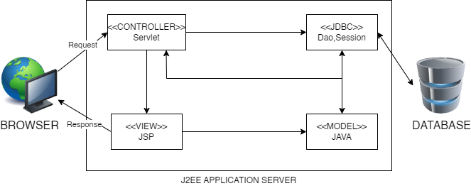
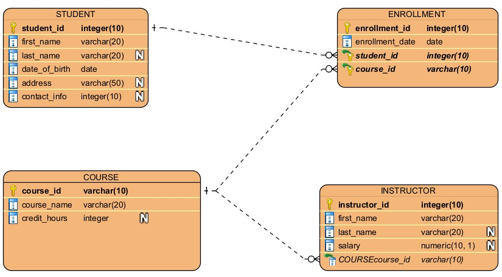

# Student Information Management System (SIS)
<p align="center">	
  	
</p>	

Welcome to the Student Information Management System (SIS)! This modern digital solution is designed to enhance student data management and communication within educational institutions. This project uses next/font to automatically optimize and load Inter, a custom Google Font.

## Table of Contents
- [About SIS](#about-sis)	
- [Architecture](#architecture)	
- [System Workflow (MVC)](#system-workflow-mvc)	
- [ER Diagram](#er-diagram)	
- [User Interface](#user-interface)	
- [Requirements](#requirements)	
- [Functional Requirements](#functional-requirements)	
- [Classes and Objects](#classes-and-objects)	
- [Screenshots](#screenshots)
- [To Run the Project](#To-run)

## About SIS

The **Student Information System (SIS)** is more than just a software application; it's a bridge to success in educational institutions. With SIS, we centralize student records, manage courses, and provide a seamless experience for administrators, instructors, and students. The system is designed to:

- Store and manage student records efficiently.
- Streamline course management.
- Offer real-time updates.
- Simplify attendance tracking.
- Serve as a communication hub for all stakeholders.

## Architecture

	

SIS follows a three-tier architecture:

- **Client (Presentation Layer):** The user interface for students, instructors, and administrators.
- **Local Host (Business Layer):** Handles core functionality and business logic.
- **Database (Data Access Layer):** Manages data storage, retrieval, and manipulation.

	

This architecture promotes modularity, scalability, flexibility, and security.

## System Workflow (MVC)

	

SIS implements the Model-View-Controller (MVC) design pattern:

- **Model:** Manages data and database interactions.
- **View:** Presents data to the user.
- **Controller:** Handles user input and application behavior.

## ER Diagram

	

The ER Diagram represents the key entities:

- **Student:** Stores personal details and contact information.
- **Course:** Represents course information.
- **Instructor:** Contains instructor details.
- **Enrollment:** Captures student-course relationships and enrollment dates.

## User Interface

- **HTML:** Used for the user interface layout.
- **JavaScript:** Handles client-side scripting and validation.
- **CSS:** Defines web page design.

## Requirements

### Hardware Requirements

- Processor: Intel Pentium 4 or higher.
- RAM: 2 GB or more.
- Cache: 1 MB.
- Hard Disk: 10 GB or more.

### Software Interface

- **Client on Internet:** Web Browser, Operating System (any).
- **Web Server:** Operating System (any), Apache 2.
- **Database:** PostgreSQL.
- **Scripting Language:** JSP, JavaScript, Servlet.

## Functional Requirements

- The server must have Apache server version 2.0 available.
- Ensure the current version of JSP is installed on the server.
- SIS uses PostgreSQL for data storage.
- HTML and CSS are used for layout and design.
- JavaScript is employed for client-side validation.

## Classes and Objects

- `Login.jsp`: HTML rendering for the login page.
- `Student.jsp`: Interface for students and course details.
- `Instructor.jsp`: Interface for instructors.
- `LoginDao.java`: Handles user authentication.
- `StudentDao.java`: Manages student data.
- `Login.java`: Handles user login and redirects.
- `Logout.java`: Manages user logout.
- `StudentServlet.java`: Handles AJAX requests for student details.
- `CourseServlet.java`: Handles AJAX requests for course details.

## Screenshots

### Login Page
	

### Student Interface
	

### Course Interface
	

### Instructor Details
	

### Instructor Course Details


## To Run

To run the project, follow these step-by-step instructions:

```bash
# 1. Download Apache Tomcat Server:
#    - Download Apache Tomcat Server from the [official website](https://tomcat.apache.org/download-90.cgi).
#    - Extract the downloaded ZIP file to a preferred location on your machine.

# 2. Copy Project Files to Tomcat's Webapps Directory:
#    - Copy the project files to the Tomcat's webapps directory:
    ```bash
    cp -r path/to/StudentInformationManagement/* path/to/tomcat/webapps/
    ```

# 3. Start Tomcat Server:
#    - Navigate to the Tomcat bin directory and run:
    ```bash
    # On Unix/Linux
    ./catalina.sh run

    # On Windows
    catalina.bat run
    ```

# 4. Open the Project in a Web Browser:
#    - Open a web browser and navigate to http://localhost:8080/StudentInformationManagement/Login.jsp.


