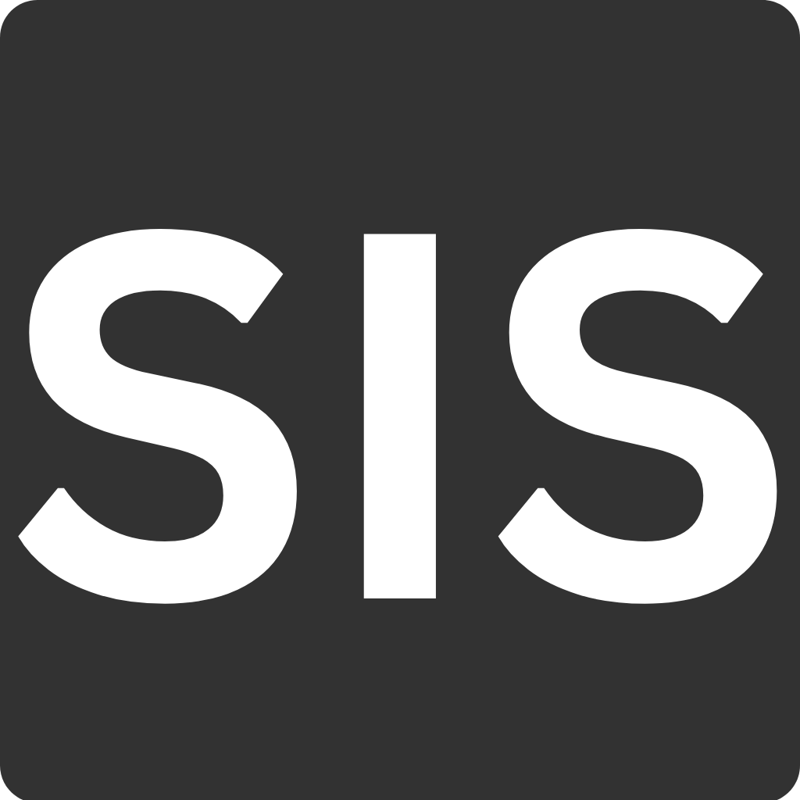

# Student Information Management System (SIS)

## Abstract

The Student Information System (SIS) is a modern digital solution designed to improve student data management and communication within educational institutions. It centralizes student records, course details, and administrative information, offering a user-friendly interface for administrators, instructors, and students. Features include student record storage, course management, real-time updates, attendance tracking, and a communication hub. The SIS streamlines administrative processes, enhances communication, and empowers educators for better student success.

## Architecture

- **Client (Presentation Layer):** The user interface for students, instructors, and administrators.
- **Local Host (Business Layer):** Handles core functionality and business logic.
- **Database (Data Access Layer):** Manages data storage, retrieval, and manipulation.

This three-tier architecture promotes modularity, scalability, flexibility, and security.

## System Workflow (MVC)

- **Model:** Manages data and database interactions.
- **View:** Presents data to the user.
- **Controller:** Handles user input and application behavior.

## ER Diagram

- **Student:** Stores personal details and contact information.
- **Course:** Represents course information.
- **Instructor:** Contains instructor details.
- **Enrollment:** Captures student-course relationships and enrollment dates.

## User Interface

- HTML for the user interface layout.
- JavaScript for client-side scripting and validation.
- CSS for web page design.

## Hardware Requirements

- Processor: Intel Pentium 4 or higher.
- RAM: 256 GB or more (consider revising this).
- Cache: 1 MB.
- Hard Disk: 10 GB or more.

## Software Interface

- Client on Internet: Web Browser, Operating System (any).
- Web Server: Operating System (any), Apache 2.
- Database: PostgreSQL.
- Scripting Language: JSP, JavaScript, Servlet.

## Communication Protocol

Ensure that the following protocols are permitted on the server side for incoming HTTP requests.

## Functional Requirements

- Apache server version 2.0 must be available.
- Current version of JSP must be installed on the server.
- PSQL database is used for data storage.
- HTML and CSS are used for layout and design.
- JavaScript is used for client-side validation.

## Classes and Objects

- `Login.jsp`: HTML rendering for the login page.
- `Student.jsp`: Interface for students and course details.
- `Instructor.jsp`: Interface for instructors.
- `LoginDao.java`: Handles user authentication.
- `StudentDao.java`: Manages student data.
- `Login.java`: Handles user login and redirects.
- `Logout.java`: Manages user logout.
- `StudentServlet.java`: Handles AJAX requests for student details.
- `CourseServlet.java`: Handles AJAX requests for course details.

## Screenshots

### Login Page

### Student Interface

### Course Interface

### Instructor Details

### Instructor Course Details

